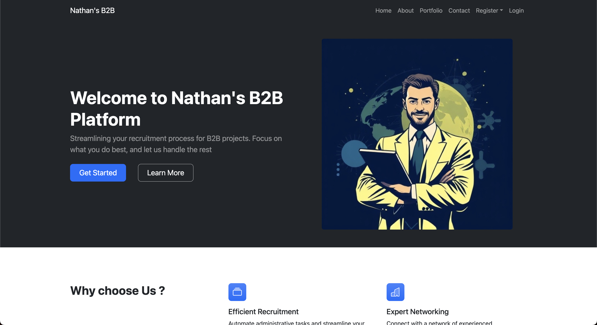
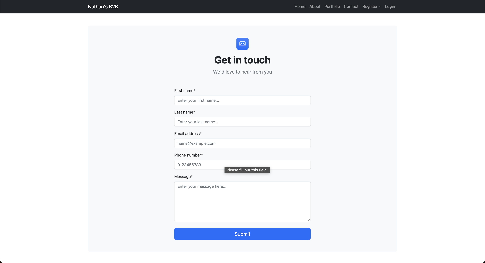
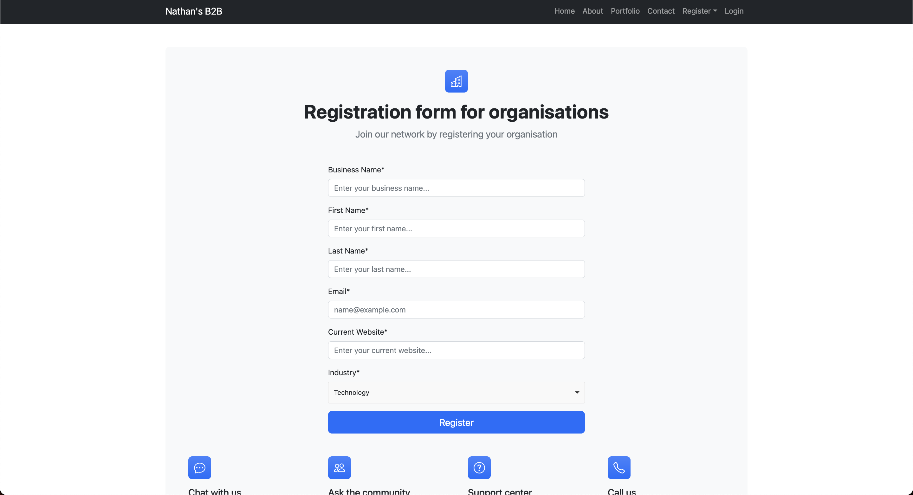
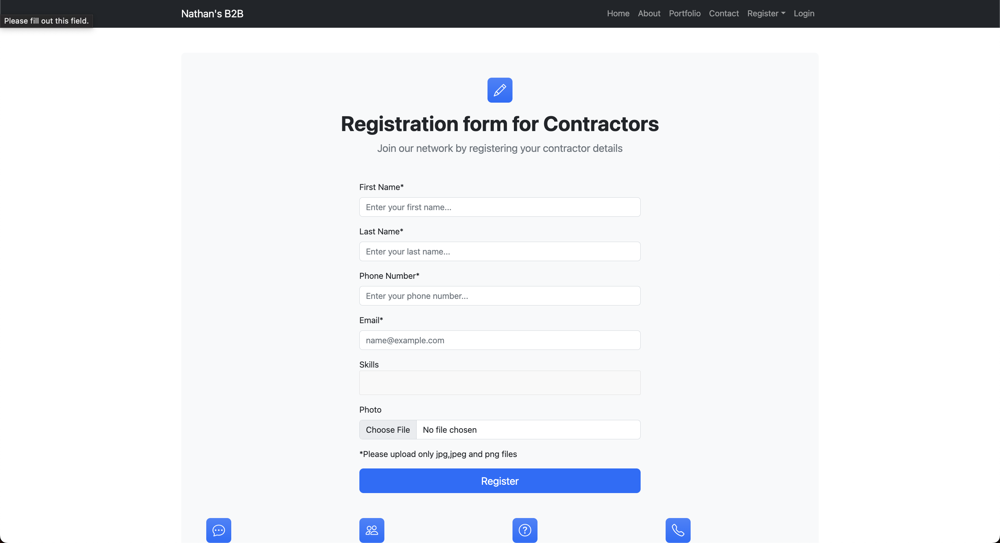
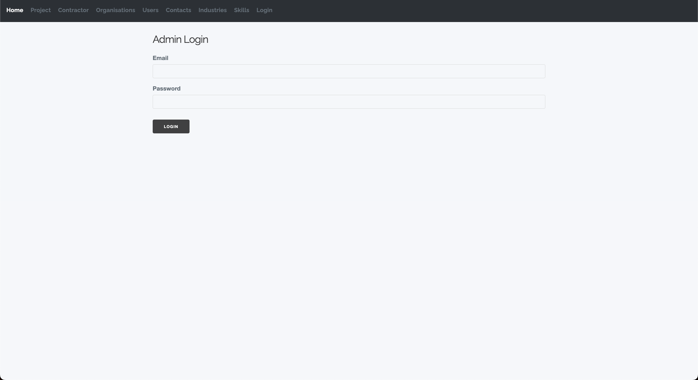
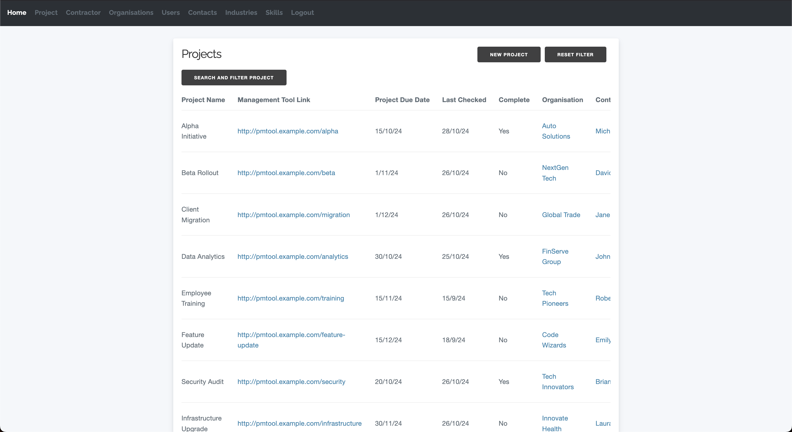
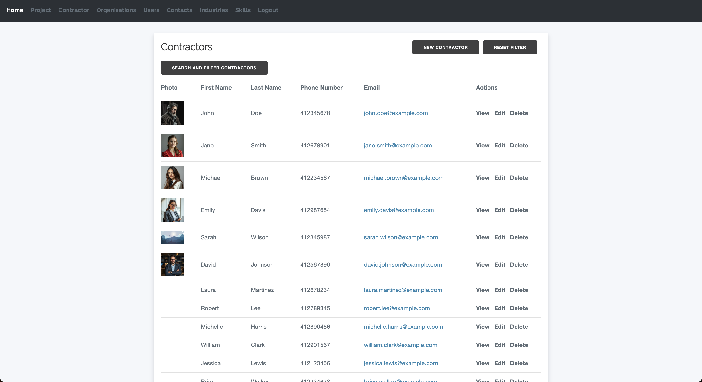

# B2B Application
--

A mini project which was an assignment of mine for my FIT2104 unit at Monash University. This project is a B2B application which allows the user to create projects and assign contractors and organisation to the project. 

The project is built using the CakePHP framework (A Rapid Development Framework) and uses MySQL as the database. The project also uses the Bootstrap framework for the front-end design.

## Preview



Registration Pages




Admin Page





## File name to import sql into phpmyadmin database for sample data

The file name is `fit2104_a5.sql` and it can be found in the root directory of the project

## Login admin details

First Name: Nathan

Last Name: Jim

Email: admin@gmail.com

Password: 12345


## Instructions on how to import Industry data into the database (Please ignore)

1. Create a Dummy Database for Organisations
```sql

    CREATE TABLE dummy_organisations (
        business_name VARCHAR(255),
        contact_first_name VARCHAR(255),
        contact_last_name VARCHAR(255),
        contact_email VARCHAR(255),
        current_website VARCHAR(255),
        industry VARCHAR(255)
    );

```

2. Import the CSV file into the database (Using my PHP admin)


3. Insert data into the industries table

```sql

INSERT INTO industries (industry_name) VALUES
('Technology'),
('Environmental'),
('Consulting'),
('Healthcare'),
('Finance'),
('Design'),
('Automotive'),
('Real Estate'),
('Software'),
('Marketing'),
('IT Security'),
('Logistics'),
('Partnerships'),
('Education');


```


4. Insert the data into the main table

```sql

INSERT INTO organisations (business_name, contact_first_name, contact_last_name, contact_email, current_website, industry_id)
SELECT
    d.business_name,
    d.contact_first_name,
    d.contact_last_name,
    d.contact_email,
    d.current_website,
    i.id
FROM
    dummy_organisations d
JOIN
    industries i ON d.industry = i.industry_name;


```

5. Delete the dummy table

```sql

DROP TABLE dummy_organisations;

```


## Some Personal Notes
Plugins Added
1. Upload Plugin
2. Authentication Plugin

Columns updated
1. Added Message column to the Contacts table
2. Added Photo column to the Contractors table
3. Changed last_checked_date in Projects table to NULL


